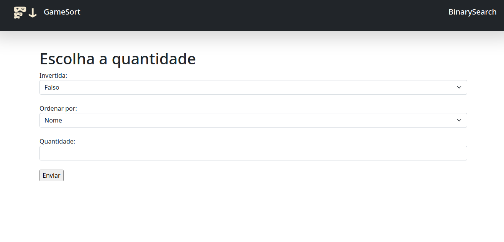

# D-C_GameSort

**Número da Lista**: X<br>
**Conteúdo da Disciplina**: Dividir para conquistar<br>

## Alunos
|Matrícula | Aluno |
| -- | -- |
| 18/0106970  |  Matheus Gabriel Alves Rodrigues |
| 18/0129287 |  Pedro Henrique Vieira Lima |

## Sobre 
O Projeto consiste em trabalhar utilizando os dados existentes no arquivo `vgsales.csv` de maneira a utilizar os algoritmos de dividir para conquistar como **MergeSort**.

## Screenshots

* **Home do projeto**


* **Resultado de uma busca**


* **Busca binaria**


## Instalação 
**Linguagem**: xxxxxx<br>
**Framework**: (caso exista)<br>
Descreva os pré-requisitos para rodar o seu projeto e os comandos necessários.

## Uso 
Pode se utilizar o projeto de duas maneiras, sendo elas:
* Usando um container Docker
* Executando apartir do código usando o Go em sua máquina local

#### Docker
Tendo o docker instalado na sua máquina utilize os seguinte comandos:

* Para construir a imagem da aplicação

```bash
docker build -t gamesort .
```
* Para executar a aplicação

```bash
docker run --name myGameSort -p 3000:8080 -d gamesort
```
A aplicação estará disponivel em [localhost:3000](localhost:3000)


* Para parar o a execução do projeto em sua máquina

```bash
docker stop myGameSort
```
#### Go

Tendo a linguagem Go instalada em sua máquina execute o seguinte comando e acessar [localhost:8080]:

```bash
cd src && go run *.go
```


